# Basic of penetration testing 

**In our journy to learn penetration testing we take a machines in HTB to can explain the basics of penetration** 

## Dancing machine .
	
   - after connecting with vpn you will spawn the machine and you will have the ip address for this machine .

   - as we explained in earlier machines you must know how to download vpn and connect with HTB server and ping for IP_address.

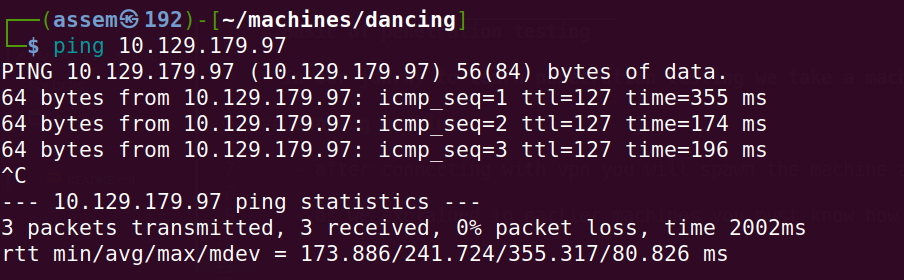

- all we have is the `IP_address` , we will begin with NMAP tool to know what is the open ports and what protocols that ports carry and  		know all we can know about this system .

- go to terminal in your device and type this command.
-  ```sudo nmap -sV -sC -A {ip_address}``` .
- you can search seperatly to learn how to use nmap.

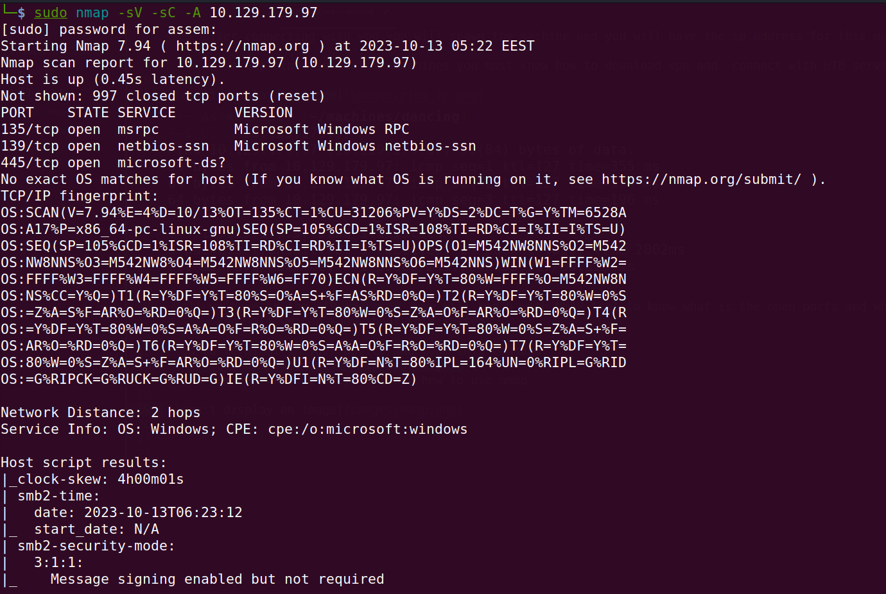


### Every machine has a basic idea to deliver to you .


***the idea of this machine is to make you know what is `SMB` service***

- as you see in `nmap report` there is some ports are, open we will search in google about port `445/tcp` .

- the result for our search as following :

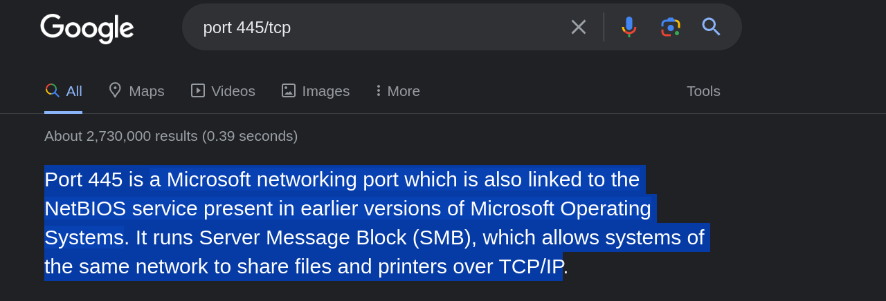

- as you see  `port445` runs an service called *SMB* , now we gonna search about it.


***what is SMB PROTOCOL?***

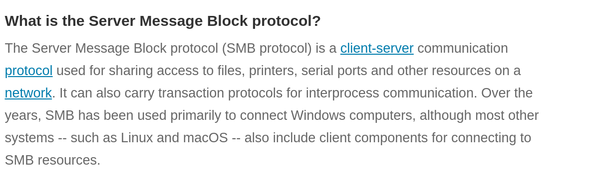

***HOW DOES THE SMB PROTOCOL WORK?***

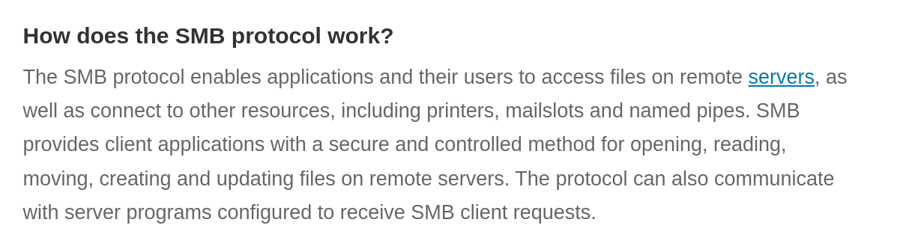

***AND HERE YOU SEE DIAGRAM TO IMAGINE HOW IT WORK***

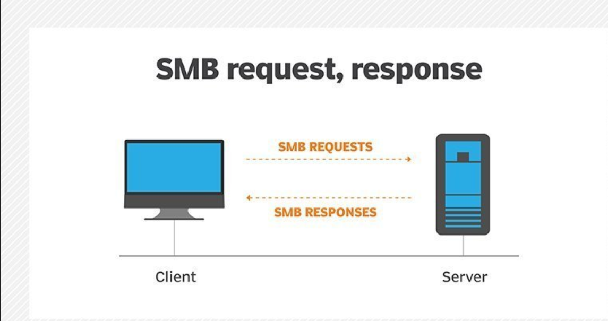

- now you know the open oprt and know what service is work on it , the question is ```how we can attack the machine and how we use this protcol to get in the machine```

#### taking the control

- we will use a scribt called smbclient

- Smbclient will attempt to connect to the remote host and check if there is any authentication required.

- If there is, it will ask you for a password for your local username.

***We should take note of this***

- If we do not specify a specific username to smbclient when attempting to connect to the remote host, it will just use your
    local machine's username.

- That is the one you are currently logged into your Virtual Machine with. 

- This is because SMB authentication always requires a username, so by not giving it one explicitly to try to login
with, it will just have to pass your current local username to avoid throwing an error with the protocol.

##### foothold

- how the command work?

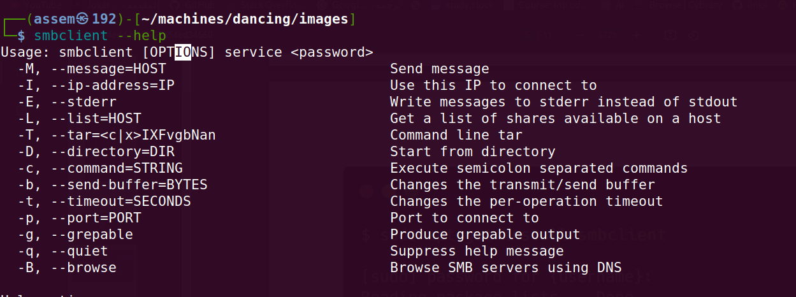

- now we gonng use this command to get a list of shares on a host.

- do not forget we will use the password for your local machine.

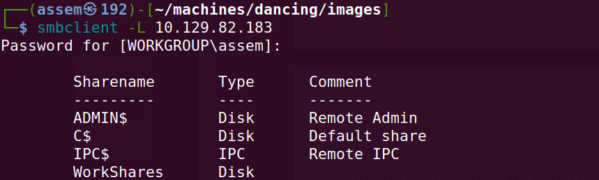

- as you see we find four shares in the target host , we will try to found if we can get in any one of them.

- we will try to connect to each of the shares except for the `IPC$` one, which is not valuable for us since it is
 not browsable as any regular directory would be and does not contain any files that we could use at this
 stage of our learning experience. We will use the same tactic as before, attempting to log in without the
 proper credentials to find improperly configured permissions on any of these shares. We'll just give a **blank**
 password for each username to see if it works. First, let us try the `ADMIN$` one.


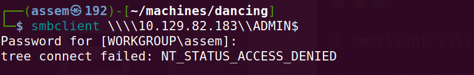

- As you see permissions failed , try `C$` .

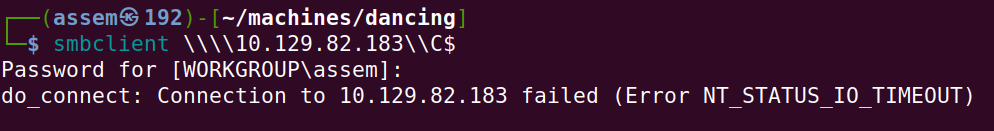

- As you see permissions failed , try `WorkShares` .

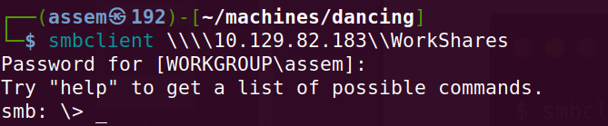

- Here we go ,***now we are in*** .

- we will type `help` command to know how to deal with this system.

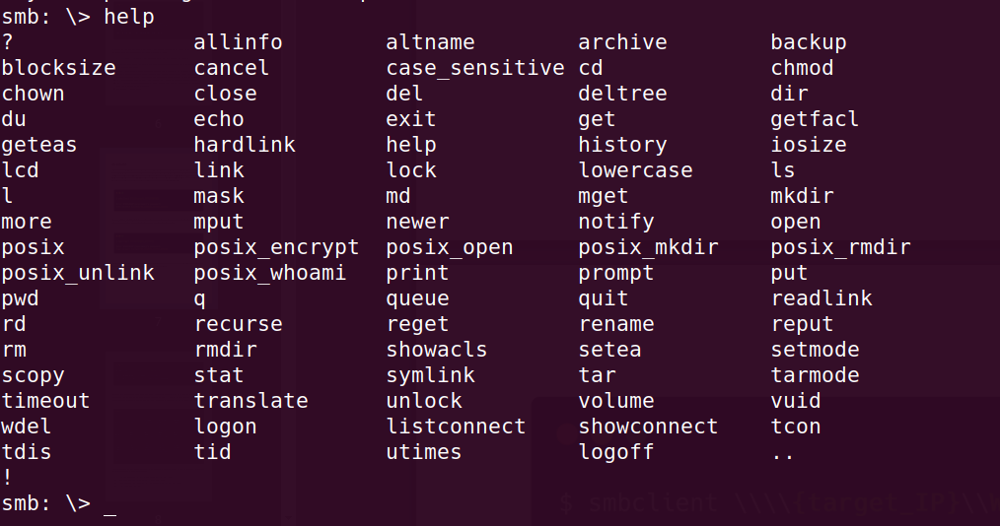


- we will use `dir` command to get a list of all directory in the machine.

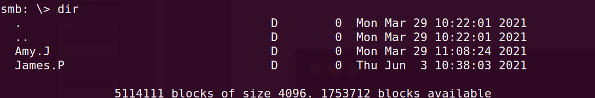

- we have to directory we will explore both of them one by one to get the falg.

- type this command ```cd Amy.J``` .

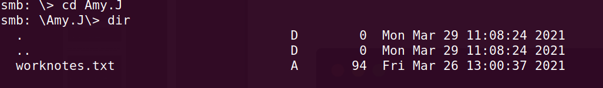

- we will go back ,because we found nothing.

- type the follwing commands

  - ```cd ../```, to go back one step

  - ```dir``` , to get alist of avilable directory

  - ```cd James.p``` , to get in james.p directory

  - `ls` , to get list of all files

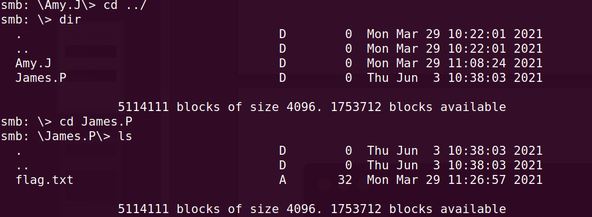


- here we found the text flag, we will to open the file or download it in our local machine .

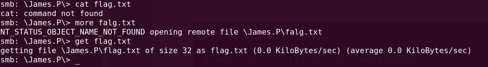

- we download the flag file in our machine , you will find it in the folder which you open terminal from.

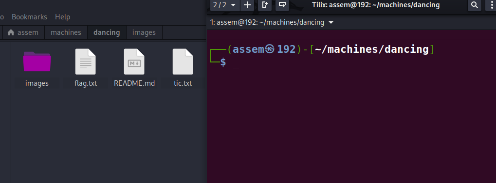

- as you see in this image i was open the terminal in **machines/dancing** dir , and the flag file downloaded in that dir.

- and now open the  flag file and submit it and that's all .